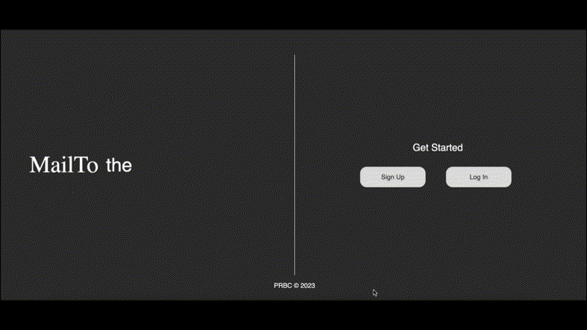
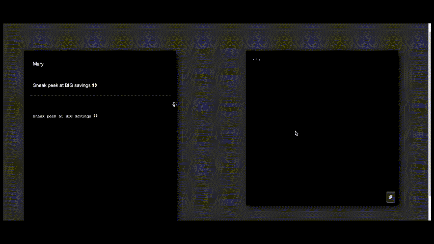

# MailTo

MailTo is an innovative AI-driven platform designed to revolutionize the way we handle email communication. With MailTo, you can effortlessly edit and send emails, simplifying the process of crafting perfect responses. It harnesses cutting-edge AI technology to provide you with contextually relevant and linguistically appropriate email suggestions. This means you can communicate faster without compromising the quality and effectiveness of your messages, making MailTo the ultimate tool for bridging the gap between instant electronic communication and the often time-consuming task of composing suitable email responses.

# Live Site
[MailTo](https://mailto.naimmiah.com/)

## Table of Contents
1. [MailTo](#mailto)
2. [Live Site](#live-site)
3. [Background and Overview](#background-and-overview)
4. [Technologies and Technical Challenges](#technologies-and-technical-challenges)
5. [Functionality and MVP](#functionality-and-mvp)
6. [Meet the Team](#meet-the-team)

## Background and Overview

In our digital era, professionals often find their inboxes flooded. Keeping up with the demand for quick yet considerate replies is challenging. Enter MailTo: an application that not only assists in drafting responses but also manages email sessions, keeps track of user preferences, and ensures a user-friendly experience. The goals for our project:

- Enhance Communication Efficiency:
    *   Provide users with AI-generated email responses that are contextually relevant and linguistically appropriate.
    *   Reduce the time and cognitive load on users to craft responses for every email, especially for repetitive and common queries.
- User-Centric Design:
    *   Develop a user-friendly interface that allows users to easily navigate through various functionalities like initiating new email sessions, customizing preferences, and more.
    *   Ensure that the AI-generated responses can be easily modified, approved, or discarded by the user, providing them with control over the communication.
- Intelligent Email Management:
    *   Enable users to search through their past emails efficiently using keywords or phrases.
    *   Implement smart categorization and prioritization of emails to assist users in managing their inbox effectively.
- Customizable User Preferences:
    *   Allow users to set and modify their preferences for email interactions, ensuring that the AI-generated responses are aligned with their communication style and requirements.

## Technologies and Technical Challenges

MailTo is built with the MERN stack (MongoDB, Express, React, and Node). The technologies we will use:

- Backend: Express with Node.js
- Frontend: React, Redux
- Database: MongoDB
- AI and Machine Learning: OpenAI GPT
- Authentication: JWT
- Email Integration: Gmail API.

#### Technical Challenges:

-   Backend: Express with Node.js
    *   Performance: Node.js runs on a single-threaded event loop. CPU-bound tasks can block the event loop and degrade performance.
    *   Error Handling: Proper handling of synchronous and asynchronous errors in Express routes and middleware.
-   Frontend: React, Redux
    *   Component Optimization: Ensuring that React components don't re-render unnecessarily. Techniques like memoization can help.
    *   State Management: Handling complex application state with Redux requires a good understanding of actions, reducers, and store.
-   Database: MongoDB
    *   Data Consistency: MongoDB uses eventual consistency, which might cause issues in situations where strict consistency is required.
    *   Query Performance: Without proper indexing, query performance can degrade, especially with large datasets.
-   AI and Machine Learning: OpenAI GPT
    *   Integrating OpenAI's GPT with your backend to generate responses in real-time.
    *   Model Tuning: Ensuring the AI model gives relevant and appropriate email responses.
    *   Cost Management: AI inference can be expensive. Monitoring and managing API call costs.
-   Authentication: JWT
    *   Token Security: Ensuring JWT tokens are stored securely (e.g., not in local storage due to XSS attacks).

## Functionality and MVP

- [ ] User authorization: sign up and log in

  

- [ ] CRUD Email Session: Users can set and customize their preferences for email interactions, initiate a new email session, view existing ones, edit email contents or settings, and delete emails no longer needed.

- [ ] AI-Generated Response: Based on the incoming email content and user preferences, the system will generate an appropriate email response, which users can choose to use, modify, or discard.
    * Challenges: Crafting responses that consistently matched the user's style and the email's context was a significant challenge. By incorporating user preferences into the AI's decision-making process, we were able to refine and enhance the quality of generated responses.

  

- [ ] Search Previous Email: Allows users to search through their past emails using keywords, user can edit or delete these emails.

- [ ] Sending Email: Once users finalize their email content, they can dispatch it directly from our platform. Furthermore, we offer seamless integration with Gmail, allowing users to fetch and send emails directly through their Gmail accounts.
    * Challenges: Integrating our app with Gmail brought forth authentication and security concerns, requiring utmost caution to protect user data. Efficiently syncing emails in real-time without overwhelming Gmail's API rate limits posed a delicate balancing act. Additionally, maintaining the integrity of varied email formats, attachments, and inline images during fetching and dispatching was a nuanced task.

## Meet the Team

-   Fanyi Tang -  Steering the ship as the Team Lead.

-   Sanjid Dewan - Perfecting user experiences on the Frontend.

-   Naim Miah - Ensuring robust operations with Backend responsibilities.

-   Yinyin Huang - The versatile Flex member, bridging gaps wherever required.
